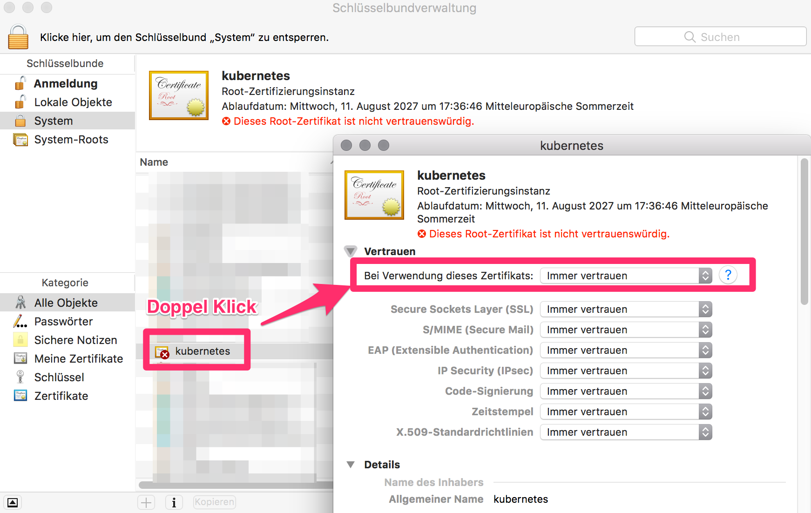
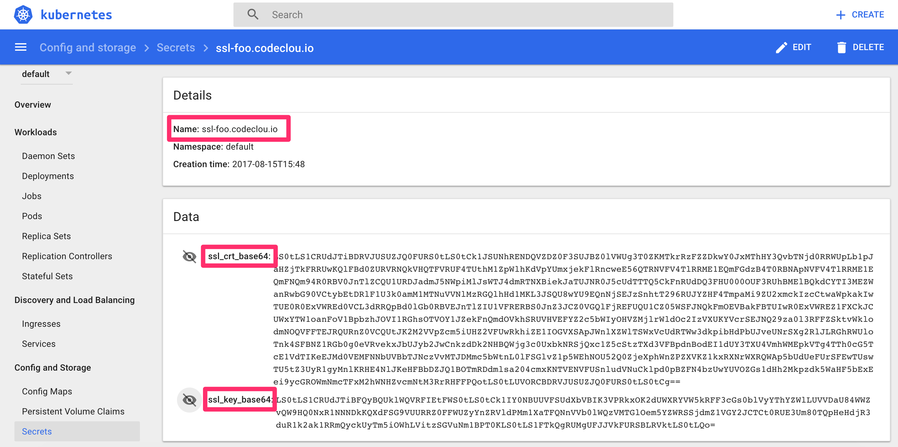

# tools-ssl-certificate-management

Issue **Self Signed SSL Certificates by your Kubernetes Master** signed by the k8s CA Certificate to use for Services.

This is basically just a convenient script based on the *[Managing TLS in a Cluster Documentation](https://kubernetes.io/docs/tasks/tls/managing-tls-in-a-cluster/)*.

----
&nbsp;

### Prerequisites

We use the clusters CA Cert to issue certificates for our services.
Therefore all Clients need to trust the Cluster CA, so the sub certs are automatically trusted.

To extract the CA cert and to issue the ssl requests, we need some tools like
[`yq`](https://github.com/kislyuk/yq),  [`jq`](https://stedolan.github.io/jq/), [`cfssl`](https://github.com/cloudflare/cfssl), [`openssl`](https://www.openssl.org/) and `kubectl`. Have them installed on your System e.g. for macOS it would be:

```
pip install jq
pip install yq
brew install cfssl
```

Extract the Cluster CA Certifacte from the kube config and base64 decode it into `kube-ca.pem`
so that we can trust it on our Mac.

```
cat ~/.kube/config \
    | yq --raw-output '.clusters[0].cluster["certificate-authority-data"]' \
    | base64 --decode > kube-ca.pem
```
&nbsp;

**Trusting the Kubernetes CA on a Client (macOS)**

Doubleclick on the `kube-ca.pem` and then doubleclick on `kubernetes` and select to trust it.




----
&nbsp;

### Issue a Certificate and create it as a k8s secret

We want to create a private key and certificate for `foo.codeclou.io` and the IP `192.168.178.66`
which is our NodeIP of the master, since we use bare metal install and will expose our Service later via HTTPS on a `NodeIP:NodePort`. You might want to use the external IP of your Loadbalancer or whatever IP you use.

:bangbang: **NOTE**: You must be on a computer where `kubectl` is executed as kubernetes admin, since the script will approve the csr!

```
git clone https://github.com/cloutainer/tools-ssl-certificate-management.git
cd tools-ssl-certificate-management
bash generate-ssl-cert.sh foo.codeclou.io 192.168.178.66
```

After the script has run you will have two files `foo.codeclou.io-key.pem` and `foo.codeclou.io.crt` and
a secret inside Kubernetes that looks like this:



----
&nbsp;

### Use Certs from Secret inside your Pod

You can now inject your certificates via [secrets as ENV vars](https://kubernetes.io/docs/concepts/configuration/secret/#using-secrets-as-environment-variables) into your Pod.


`myapp.yml`

EXCERPT:

```
...
    env:
    - name: SERVER_NAME
      value: "foo.codeclou.io"
    - name: SSL_KEY
      valueFrom:
        secretKeyRef:
          name: ssl-foo.codeclou.io
          key: ssl_key_base64
    - name: SSL_CRT
      valueFrom:
        secretKeyRef:
          name: ssl-foo.codeclou.io
          key: ssl_crt_base64
```

FULL:

```
apiVersion: v1
kind: Service
metadata:
 name: myapp
  labels:
    run: myapp
spec:
  type: NodePort
  ports:
  - port: 4443
    protocol: TCP
    name: https
  selector:
    run: myapp
---
apiVersion: extensions/v1beta1
kind: Deployment
metadata:
  name: myapp
spec:
  replicas: 2
  template:
    metadata:
      labels:
        run: myapp
    spec:
      containers:
      - name: myapp
        image: nexus.home.codeclou.io:8444/codeclou/myapp:v1
        ports:
        - containerPort: 4443
          protocol: TCP
        env:
        - name: SERVER_NAME
          value: "myapp.k8s.home.codeclou.io"
        - name: SSL_KEY
          valueFrom:
            secretKeyRef:
              name: ssl-myapp.k8s.home.codeclou.io
              key: ssl_key_base64
        - name: SSL_CRT
          valueFrom:
            secretKeyRef:
              name: ssl-myapp.k8s.home.codeclou.io
              key: ssl_crt_base64
      imagePullSecrets:
      - name: regsecret
```

-----
&nbsp;

### License

[MIT](https://github.com/cloutainer/tools-ssl-certificate-management/blob/master/LICENSE) © [Bernhard Grünewaldt](https://github.com/clouless)
